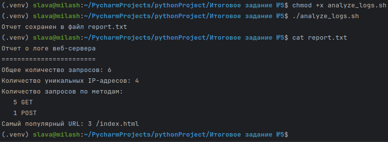

# Итоговое задание №5
Используя полученные знания, необходимо решить следующую задачу.

Провести анализ логов, которые находятся на сервере, но ничего кроме Bash и Linux на нем нет, а сделать это нужно быстро и эффективно. Поэтому необходимо решить задачу, используя только эти инструменты.

Команда для генерации логов выглядит следующим образом -
```
cat <<EOL > access.log
192.168.1.1 - - [28/Jul/2024:12:34:56 +0000] "GET /index.html HTTP/1.1" 200 1234
192.168.1.2 - - [28/Jul/2024:12:35:56 +0000] "POST /login HTTP/1.1" 200 567
192.168.1.3 - - [28/Jul/2024:12:36:56 +0000] "GET /home HTTP/1.1" 404 890
192.168.1.1 - - [28/Jul/2024:12:37:56 +0000] "GET /index.html HTTP/1.1" 200 1234
192.168.1.4 - - [28/Jul/2024:12:38:56 +0000] "GET /about HTTP/1.1" 200 432
192.168.1.2 - - [28/Jul/2024:12:39:56 +0000] "GET /index.html HTTP/1.1" 200 1234
EOL
```
Написать к файлу с логами несколько команд и упаковать их в .sh скрипт, а именно -
1. Подсчитать общее количество запросов;
2. Подсчитать количество уникальных IP-адресов. **Строго с использованием awk**;
3. Подсчитать количество запросов по методам (GET, POST и т.д.). **Строго с использованием awk**;
4. Найти самый популярный URL. **Строго с использованием awk**;
5. Создать отчет в виде текстового файла. Название текстового файла - [**report.txt**](report.txt).

Результат, который должен получиться при запуске [**analyze_logs.sh**](analyze_logs.sh) следующий -



[Файл с логами](access.log)

:arrow_up: [В начало](#итоговое-задание-5)